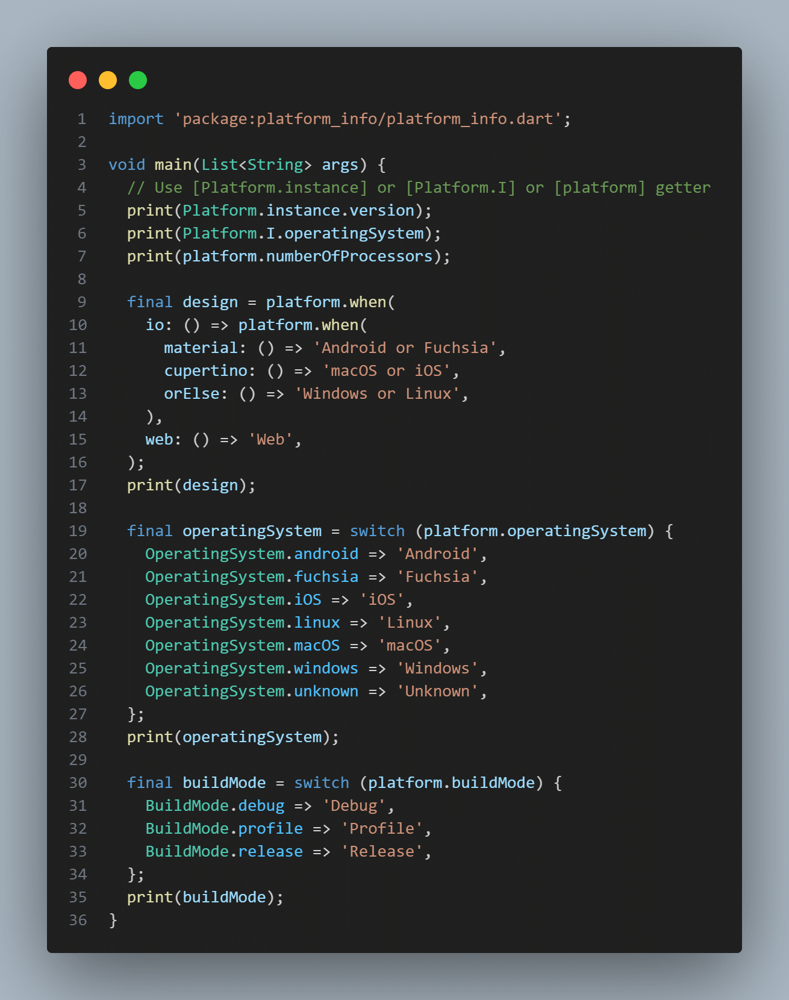

# platform_info

## About

Cross-platform io/html package.
Works on the web, mobile phones, desktops and console.
Fully caches itself on first initialization.

Easy to use, just add to `pubspec.yaml` as dependency and then import:
`import 'package:platform_info/platform_info.dart';`

Platform is a singleton, and the default way to access an instance of Platform is to call static getters:
`Platform.instance` or `Platform.I` or `platform`

## Usage

[Example of using the library](https://pub.dev/packages/platform_info/example) to get the current platform info

## Platform Information

Provides platform information such as:

- Build mode

  - release
  - profile
  - debug

- Host platform type

  - io (vm, desktops, mobile, console)
  - web (html, js, browser)

- Operating system

  - Fuchsia
  - Linux
  - MacOS
  - Windows
  - iOS
  - Android
  - Unknown

- Version (`<unknown>` if not available)

- Locale string (`en` if not available)

- The number of individual execution units of the machine (`0` if not available)

- Operating system is a known type

- Is a Web-based applications

- Is a I/O supporting for non-web applications

- Is a mobile device (Android, iOS)

- Is a desktop device (Windows, macOS, Fuchsia)

- Is Material design device (Android, Fuchsia)

- Is Cupertino design device (macOS, iOS)

- is Linux

- is macOS

- is Windows

- is android

- is iOS

- is fuchsia

- `when` method allowing to compose a complex condition

## Pattern matching

Run functions that satisfy the current state of the platform.
You can use nested methods to compose more complex queries.

##### Operating System

[fuchsia] - whether the operating system is a version of Fuchsia
[windows] - whether the operating system is a version of Windows
[android] - whether the operating system is a version of Android
[iOS] - whether the operating system is a version of iOS
[macOS] - whether the operating system is a version of MacOS
[linux] - whether the operating system is a version of Linux
[unknown] - operating system unknown

##### Design

[material] - is material (Android, Fuchsia)
[cupertino] - is cupertino (macOS, iOS)

##### Mobile or desktop

[mobile] - is mobile device (Android, iOS)
[desktop] - is desktop device (Windows, MacOS, Fuchsia)

##### IO or Web

[web] - is web-based applications
[io] - is I/O supporting for non-web applications

##### Build mode

[release] - release build mode
[profile] - profile build mode
[debug] - debug build mode
[orElse] - any callback was not called

##### Sequence of checks

1. Operating System
2. Design
3. Mobile/Desktop
4. IO/Web
5. Build mode
6. Call [orElse] if any callback was not called

## Coverage

## Changelog

Refer to the [Changelog](https://github.com/plugfox/platform_info/blob/master/CHANGELOG.md) to get all release notes.

## Maintainers

[Plague Fox](https://plugfox.dev)

## Funding

If you want to support the development of our library, there are several ways you can do it:

- [Buy me a coffee](https://www.buymeacoffee.com/plugfox)
- [Support on Patreon](https://www.patreon.com/plugfox)
- [Subscribe through Boosty](https://boosty.to/plugfox)

We appreciate any form of support, whether it's a financial donation or just a star on GitHub. It helps us to continue developing and improving our library. Thank you for your support!

## License

[MIT](https://opensource.org/licenses/MIT)

## Tags

cross, platform, info
